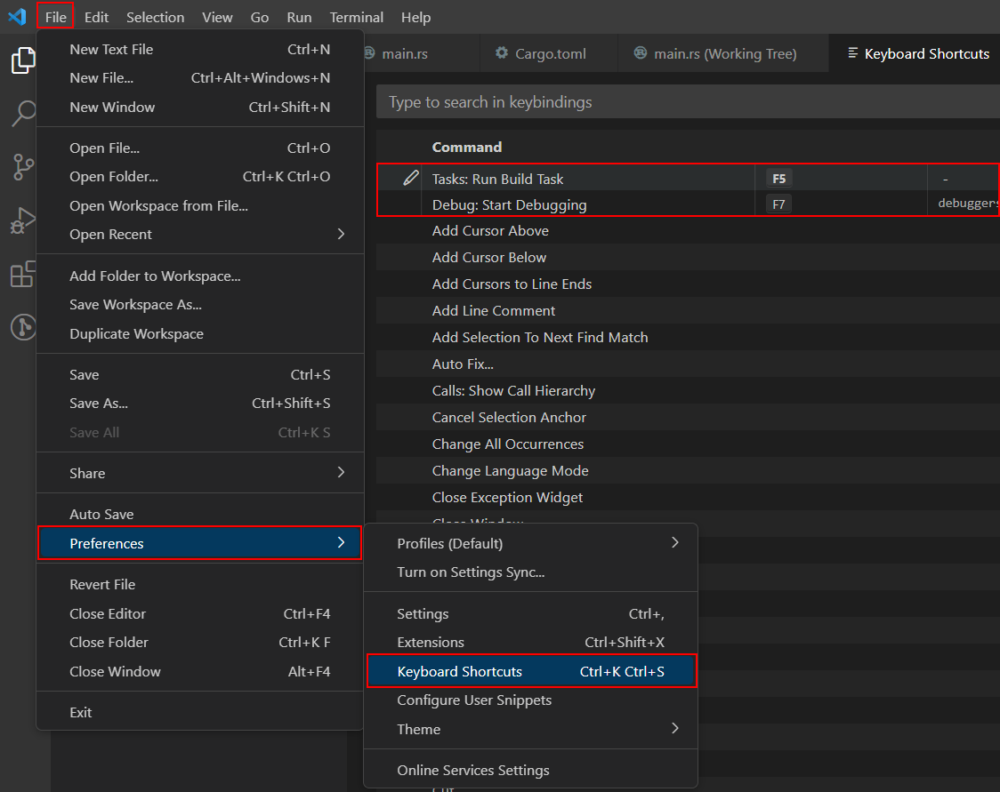

# mycargo

The goal of this project is to make life easier when creating a new rust project.

## What can it do

1. The programm creates a new project with cargo new.
2. It creates all configuration files necessary to debugging or run rust with a single shourtcut.
3. It opens vs code automatically.

## How to use

1. Download or build executable yourself.
2. Make it globally available (with path variable on windwos).
3. Run in cmd: mycargo new my_new_project

## VS Code setup

My current setup is to launch the project with F5 and debug with F7.
This can be changed in the vs code settings.

## OS support

I tested it on Win10 and Ubuntu.
